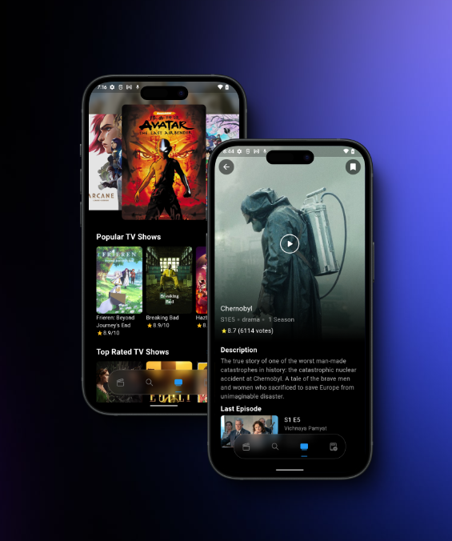

# Clean Architecture Movie App

## Description

This app is a Clean Architecture Movie App built with Flutter, using the TMDB API. It allows users to browse and search for movies, view movie details, and discover popular movies.

## Getting Started

To get started with this project, follow these steps:

1. Clone the repository.
2. Install Flutter and Dart.
3. Set up your TMDB API key.
4. Run the app on your preferred device or emulator.

For any further assistance, please consult the [Flutter documentation](https://docs.flutter.dev/) or reach out to the project contributors.

## Project Structure

```plaintext
TMDB-App/
├── presentation/           # UI layer, Widgets, Screens, and related components
│   ├── widgets/
│   ├── screens/
│   └── ...
├── domain/                 # Business logic layer, Entities, Use cases, and Repositories Interfaces
│   ├── entities/
│   ├── use_cases/
│   ├── repositories/
│   └── ...
├── data/                   # Data layer, Implementations of Repositories, API calls, Data sources
│   ├── models/
│   ├── repositories/
│   ├── data_sources/
│   ├── api/                # API client and services
│   └── ...
├── core/                   # Core utilities, constants, theme, error handling, and helpers
│   ├── utils/
│   ├── constants/
│   ├── theme/
│   ├── errors/
│   └── ...
├── config/                 # Configuration files, including environment variables
│   ├── environment/
│   └── ...
├── main.dart               # Entry point of the application
├── injector.dart           # Dependency injection setup
├── pubspec.yaml            # Project dependencies and assets
├── README.md               # Project documentation
└── test/                   # Test files for the app
    └── ...
```

## Screenshot

 
